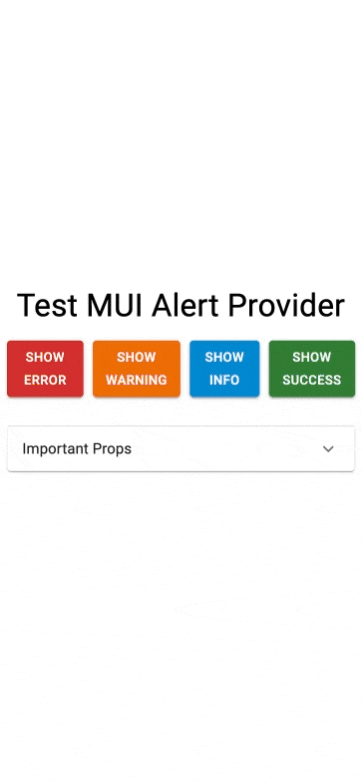

# MUI Alert Provider

A lightweight and customizable wrapper for integrating [MUI Alert](https://mui.com/material-ui/react-alert/?srsltid=AfmBOorG16fDWlZUFpNDld6CbDRdpPOA8eTPa9eEriOYl9CywGZFowmu) into your react application, enabling you to build a floating stack of alerts within minutes.

## Demo

[](
https://codesandbox.io/p/sandbox/mui-alert-provider-demo-kj6mjz)

### Desktop View


### Mobile View


## Features

- Floating stacks of MUI Alerts that integrate seamlessly with any web UI.
- Utilizes the [Context API](https://react.dev/reference/react/hooks#context-hooks) and [React Hooks](https://react.dev/learn/reusing-logic-with-custom-hooks) to enable quick integration with any React application.
- Fully customizable to match your application's design.
- Built with accessibility in mind, fully meeting MUI's accessibility requirements to ensure an inclusive experience for all users.

## Installation

```bash
npm install mui-alert-provider
```

or

```bash
yarn add mui-alert-provider
```

## Usage
Wrap your application with the `AlertProvider`.  
If you're using the `ThemeProvider` from MUI, ensure that the `AlertProvider` is a child of it.

```jsx
import React from 'react';
import ReactDOM from 'react-dom';
import { AlertProvider } from 'mui-alert-provider';

const App = () => (
	<AlertProvider>
		{/* Your application components */}
	</AlertProvider>
);

ReactDOM.render(<App />, document.getElementById('root'));
```

Trigger alerts from any part of your application using the `useAlert` hook. 
This hook provides access to the `addAlert` method, allowing you to add a new alert to the stack.

```jsx
import { useAlert } from 'mui-alert-provider';

const MyComponent = () => {
	const {addAlert} = useAlert();

	const handleClick = () => {
		addAlert({
			message: "Please enter your name to continue",
			severity: "error",
		})
	};

	return <button onClick={handleClick}>Show Alert</button>;
};
```

## API

### `AlertProvider`

Wraps your application and provides alert context. 

#### Props

| Prop Name         | Type       | Required | Default   | Description                                                                 |
|-------------------|------------|----------|-----------|-----------------------------------------------------------------------------|
| `children`        | `node`     | Yes      | N/A       | React nodes to render inside the provider.                                 |
| `limit`           | `number`   | No       | `4`       | The maximum number of alerts that can be displayed simultaneously.                             |
| `mobileLimit`     | `number`   | No       | `1`       | The maximum number of alerts that can be displayed simultaneously on screens with a width smaller than `mobileBreakpoint`.                       |
| `width`          | `string`   | No       | `"20%"`    | Specifies the width of the alert container. Accepts any valid CSS width value. On resolutions smaller than `mobileBreakpoint`x, it will automatically adjust to 100% for better mobile responsiveness. |
| `minWidth`       | `string`   | No       | `"280px"`    | Specifies the minimum width of the alert container. Accepts any valid CSS width value. On resolutions smaller than `mobileBreakpoint`x, it will automatically adjust to 100% for better mobile responsiveness. |
| `containerSx`    | `object`   | No       | `{}`       | The `sx` prop to customize the styling of the alert container. Accepts any valid MUI `sx` object. |
| `duration`        | `number`   | No       | `300`     | The time (in milliseconds) that the alert's animation lasts, including its appearance and disappearance transitions.    |
| `muiAlertProps`   | `object`   | No       | `{}`       | Props to be passed directly to the underlying [MUI Alert](https://mui.com/material-ui/api/alert/) component. |
| `muiStackProps`   | `object`   | No       | `{}`       | Props to be passed directly to the underlying [MUI Stack](https://mui.com/material-ui/api/stack/) component. |
| `mobileBreakpoint` | `number`   | No       | `600`     | The breakpoint width in pixels to consider a device as mobile. Alerts will adjust their behavior accordingly. |

### `useAlert`

Hook to access alert functions.

#### Methods

| Method                          | Description                                                                                     |
|---------------------------------|-------------------------------------------------------------------------------------------------|
| `addAlert({ message, severity })` | Adds a new alert to the stack. `severity` defaults to `defaultSeverity` provided to `AlertProvider`, which defaults to `error`. |

## Contributing

Contributions are welcome! Please open an issue or submit a pull request.

## License

This project is licensed under the [MIT License](LICENSE).
